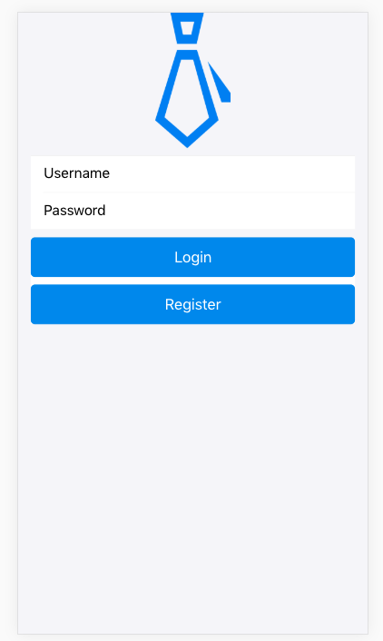
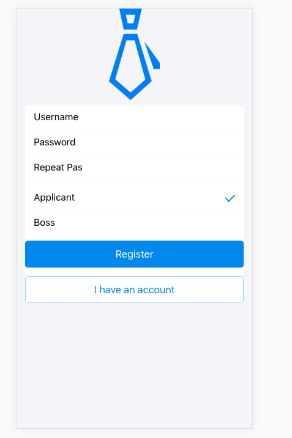
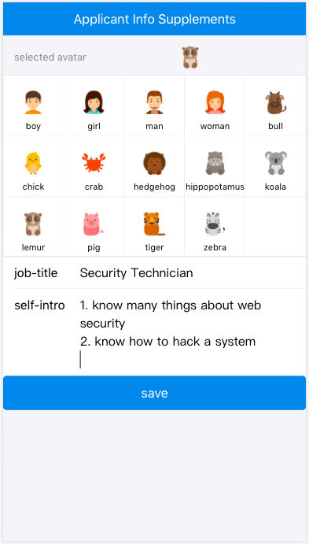
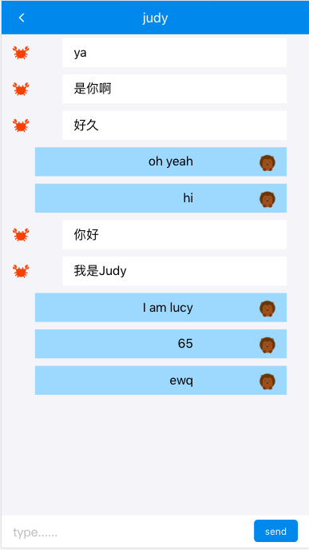
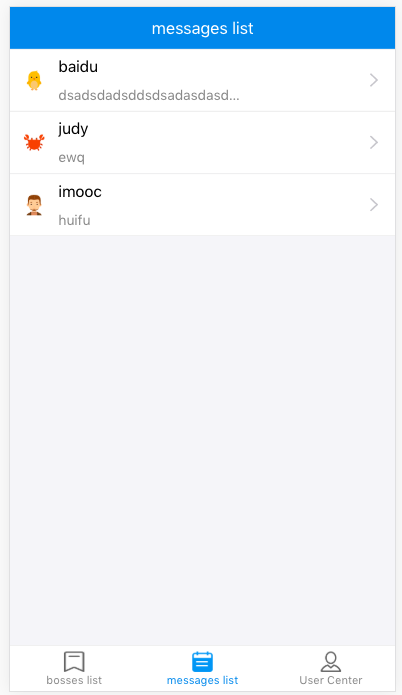
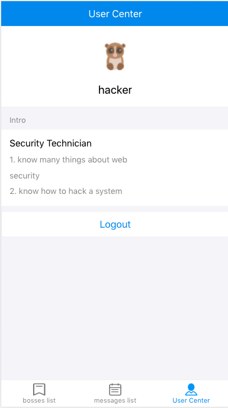
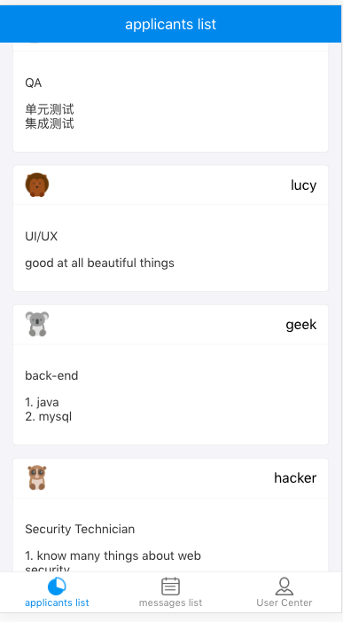
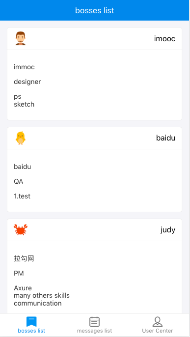

### This project is an app using React, React-Router, React-Redux, Express, Socket.io MongoDB, Ant Design ( A design pattern or language similar to Material Design)


### to start back-end part, you need install MongoDB, nodemon and run them, run(It's so far on port 9093)
```
npm run server-dev
```


### start front-end part project by run ( on port 3000)

```
npm start
```

### to build this project, just run
```
npm run build
```

### If you want use SSR(server side rendering), run the build task first, then run
```
npm run server
```
### And open the app on localhost:9093

### Include some app's screenshot here
#### login

#### register

#### fill-userinfo

#### msgs

#### msg-list

#### user-center

#### applicants-list

#### bosses-list

